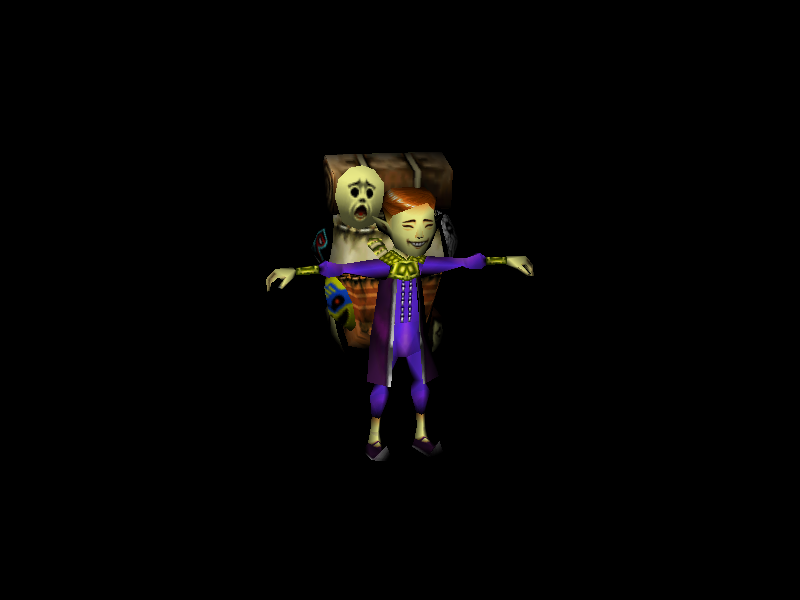
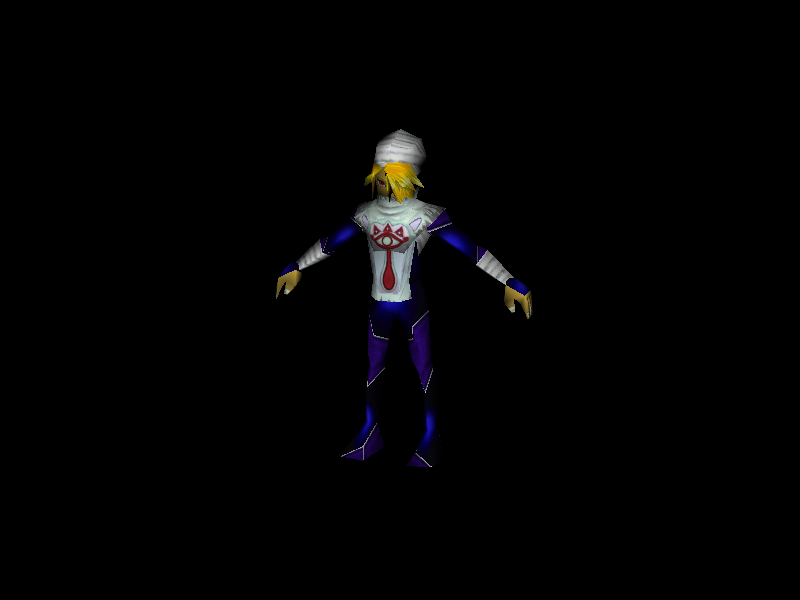
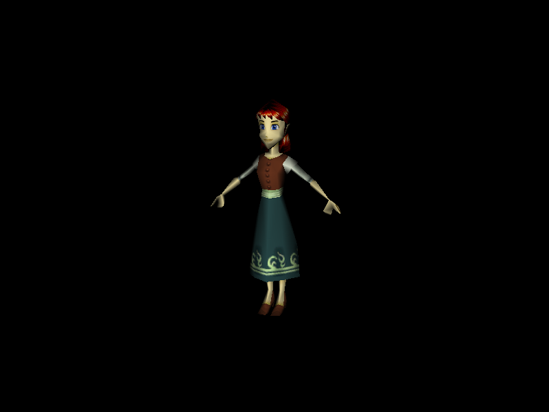
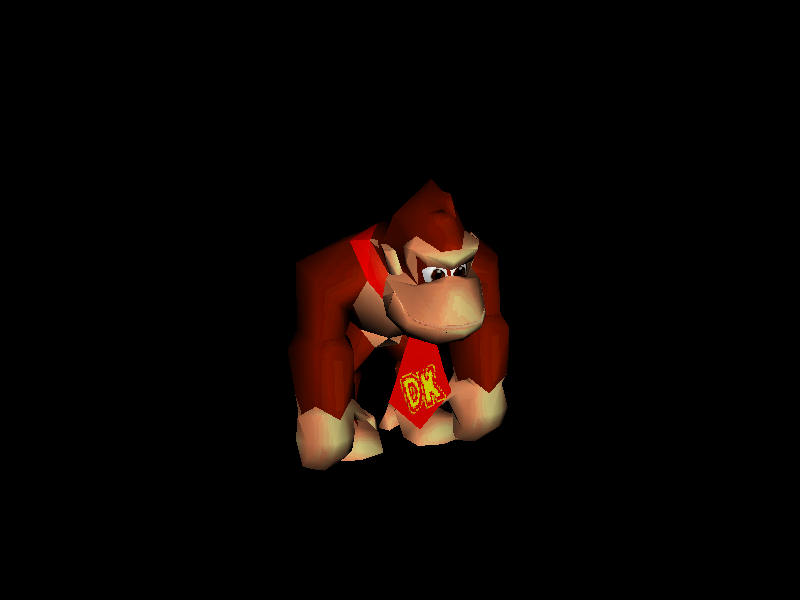
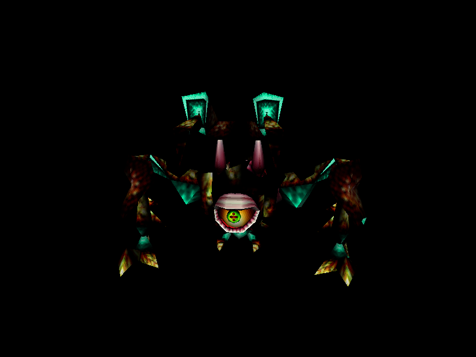
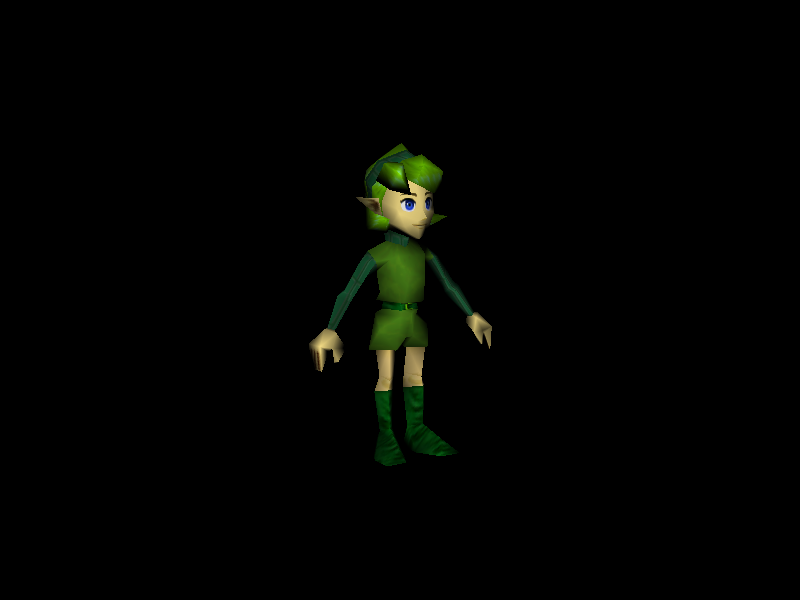
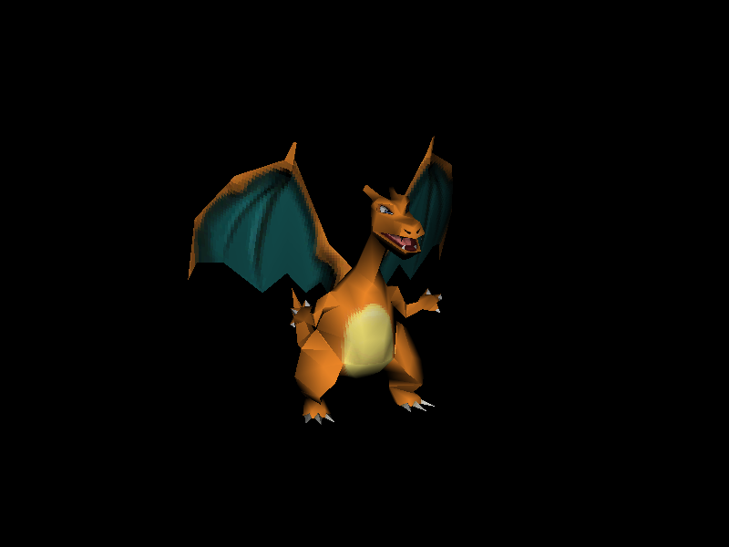

# gel

Gel (Graphical Emulation Layer) is an N64-like software renderer written in 512 lines,
with documentation.

    go get -u github.com/200sc/gel
    go run main.go

Rotate the screen with the mouse.

This is a Go port of the original C source: https://github.com/yellingintothefan/gel

